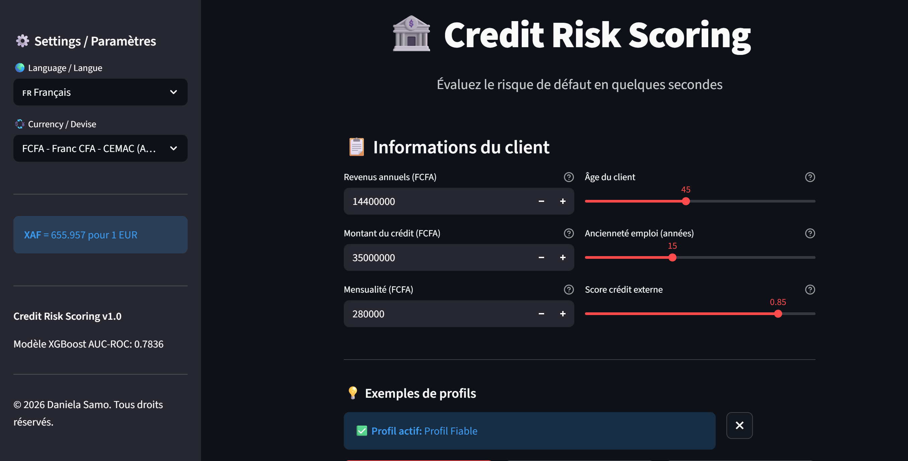
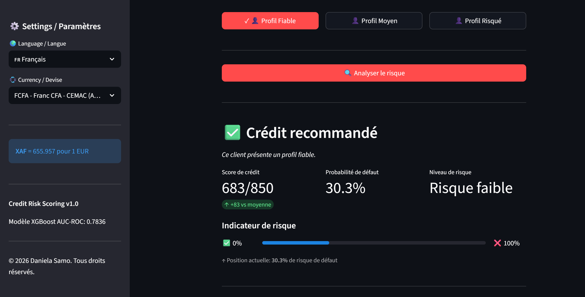
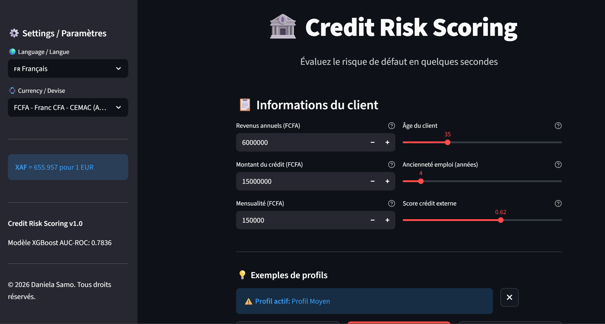
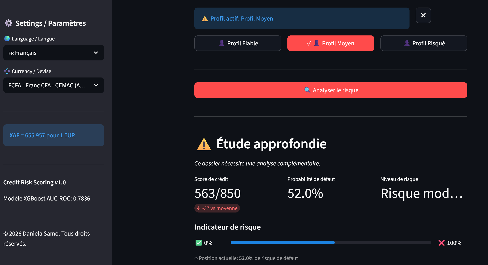
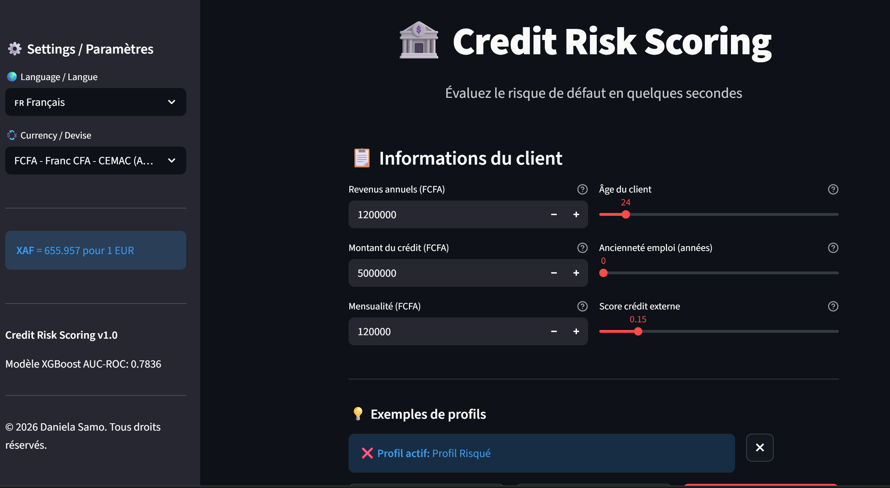
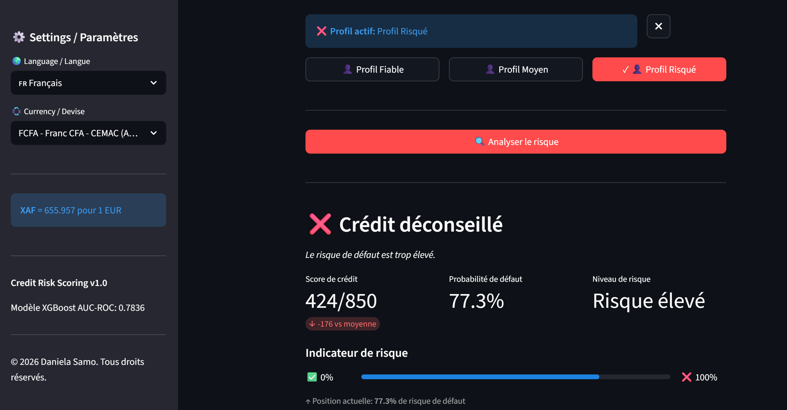

# Credit Risk Scoring Pipeline

Pipeline complet de scoring de risque de crédit avec modèle ML, API, monitoring et interface interactive.

---

## Aperçu

Ce projet implémente un système complet de scoring crédit qui prédit la probabilité de défaut de paiement d'un emprunteur. Il démontre des compétences en Data Engineering et Data Science dans un environnement prêt pour la production.

**Problème métier :** Les institutions financières doivent évaluer la solvabilité des demandeurs de prêt, en particulier ceux ayant peu ou pas d'historique de crédit.

**Solution :** Un pipeline ML qui traite les données du demandeur, génère un score de risque et fournit des prédictions explicables.

---

## Fonctionnalités

- **Modèle XGBoost** optimisé avec Optuna (50 essais)
- **API REST** avec FastAPI (prédiction + explicabilité SHAP)
- **Interface utilisateur** Streamlit interactive
- **Multilingue** : Français et Anglais
- **Multi-devises** : EUR, USD, XAF, XOF
- **Monitoring** : Prometheus + Grafana
- **Orchestration** : Apache Airflow
- **Tests** : 31 tests unitaires (100% passent)
- **Conteneurisation** : Docker Compose (6 services)

---

## Démonstration

L'application analyse le profil d'un client et fournit une décision en temps réel avec explicabilité SHAP.

### Profil Fiable - Crédit recommandé
Client cadre supérieur avec excellent historique de crédit.




**Résultat :** Score 683/850 | Risque 30.3% | ✅ Crédit recommandé

---

### Profil Moyen - Étude approfondie
Client cadre moyen avec historique de crédit correct mais pas excellent.




**Résultat :** Score 563/850 | Risque 52.0% | ⚠️ Étude approfondie

---

### Profil Risqué - Crédit déconseillé
Client débutant avec faibles revenus et mauvais historique.




**Résultat :** Score 424/850 | Risque 77.3% | ❌ Crédit déconseillé

---

## Performance du Modèle

| Métrique | Valeur | Description |
|----------|--------|-------------|
| **AUC-ROC** | 0.7836 | Capacité de discrimination |
| **Gini** | 0.5673 | Coefficient de Gini |
| **Recall** | 70% | Détection des défauts |
| **Precision** | 18.6% | Précision sur les défauts |
| **F1-Score** | 0.294 | Moyenne harmonique |

> Le modèle détecte 70% des défauts réels, ce qui est crucial pour la gestion du risque.

---

## Architecture

```
┌─────────────────────────────────────────────────────────────────────────┐
│                      CREDIT RISK SCORING PIPELINE                       │
├─────────────────────────────────────────────────────────────────────────┤
│                                                                         │
│  ┌──────────┐    ┌──────────┐    ┌──────────┐    ┌──────────┐          │
│  │ DONNÉES  │───▶│   ETL    │───▶│ FEATURE  │───▶│  MODÈLE  │          │
│  │  SOURCE  │    │ PIPELINE │    │   ENG.   │    │ XGBOOST  │          │
│  │ (Kaggle) │    │          │    │          │    │          │          │
│  └──────────┘    └──────────┘    └──────────┘    └──────────┘          │
│       │               │               │               │                 │
│       ▼               ▼               ▼               ▼                 │
│  8 fichiers      PostgreSQL     225 features      AUC: 78%             │
│  CSV (2.5 GB)    3.7M lignes                                           │
│                                                       │                 │
│                                                       ▼                 │
│  ┌──────────┐    ┌──────────┐    ┌──────────┐    ┌──────────┐          │
│  │ GRAFANA  │◀───│PROMETHEUS│◀───│ FAST API │◀───│   SHAP   │          │
│  │DASHBOARD │    │ MÉTRIQUES│    │  SERVEUR │    │ EXPLICAB.│          │
│  └──────────┘    └──────────┘    └──────────┘    └──────────┘          │
│       :3000          :9090           :8000                              │
│                                       │                                 │
│                                       ▼                                 │
│                                 ┌──────────┐                           │
│                                 │STREAMLIT │                           │
│                                 │    UI    │                           │
│                                 │  :8501   │                           │
│                                 └──────────┘                           │
│                                                                         │
│  ┌──────────────────────────────────────────────────────────────────┐  │
│  │                    AIRFLOW (Orchestration) :8080                  │  │
│  └──────────────────────────────────────────────────────────────────┘  │
└─────────────────────────────────────────────────────────────────────────┘
```

---

## Stack Technique

| Catégorie | Technologie | Version |
|-----------|-------------|---------|
| **Langage** | Python | 3.12.3 |
| **ML** | XGBoost, scikit-learn | 3.1.3 |
| **Explicabilité** | SHAP | 0.50.0 |
| **Optimisation** | Optuna | 3.4+ |
| **Base de données** | PostgreSQL | 15-alpine |
| **API** | FastAPI | 0.128.0 |
| **Interface** | Streamlit | 1.53.1 |
| **Orchestration** | Apache Airflow | 3.1.6 |
| **Monitoring** | Prometheus | v2.47.0 |
| **Dashboards** | Grafana | 10.2.0 |
| **Conteneurs** | Docker + Docker Compose | - |

---

## Structure du Projet

```
Credit_Risk_Scoring_Project/
├── README.md                 # Ce fichier
├── requirements.txt          # Dépendances Python (110+ packages)
├── docker-compose.yml        # Orchestration des 6 services
├── Dockerfile                # Image API
├── Dockerfile.streamlit      # Image Streamlit
│
├── data/
│   ├── raw/                  # Données brutes Kaggle (2.5 GB)
│   ├── processed/            # Données nettoyées
│   └── features/             # Features engineerées (225 colonnes)
│
├── notebooks/
│   ├── 01_EDA.ipynb          # Analyse exploratoire
│   └── 03_modeling.ipynb     # Entraînement + SHAP
│
├── src/
│   ├── data/
│   │   ├── ingestion.py      # Chargement PostgreSQL
│   │   └── preprocessing.py  # Nettoyage des données
│   └── features/
│       └── build_features.py # Création des 103 features
│
├── api/
│   └── main.py               # API FastAPI (4 endpoints)
│
├── streamlit/
│   └── app.py                # Interface utilisateur
│
├── airflow/dags/
│   └── credit_risk_pipeline.py  # DAG d'orchestration
│
├── monitoring/
│   ├── prometheus.yml        # Configuration Prometheus
│   └── grafana/dashboards/   # Dashboard Grafana
│
├── models/                   # Modèle entraîné + artefacts
├── tests/                    # 31 tests unitaires
├── docs/                     # Documentation détaillée
└── configs/
    └── config.yaml           # Configuration centralisée
```

---

## Données

**Source :** [Kaggle - Home Credit Default Risk](https://www.kaggle.com/c/home-credit-default-risk)

| Table | Description | Lignes |
|-------|-------------|--------|
| application_train | Données principales avec TARGET | 307 511 |
| bureau | Historique crédit autres institutions | 1 716 428 |
| bureau_balance | Soldes mensuels bureau | 27 299 925 |
| previous_application | Demandes précédentes Home Credit | 1 670 214 |
| POS_CASH_balance | Soldes prêts POS/cash | 10 001 358 |
| credit_card_balance | Soldes cartes de crédit | 3 840 312 |
| installments_payments | Historique des paiements | 13 605 401 |

**Variable cible :** `TARGET` (8.07% de défauts - classes déséquilibrées)

---

## Démarrage Rapide

### Prérequis

- Python 3.12+
- Docker et Docker Compose
- Identifiants API Kaggle (pour télécharger les données)

### Installation

```bash
# Cloner le dépôt
git clone https://github.com/Danesamo/Credit_Risk_Scoring_Project.git
cd Credit_Risk_Scoring_Project

# Créer l'environnement virtuel
python -m venv venv
source venv/bin/activate  # Linux/Mac
# ou : venv\Scripts\activate  # Windows

# Installer les dépendances
pip install -r requirements.txt

# Télécharger les données depuis Kaggle
kaggle competitions download -c home-credit-default-risk
unzip home-credit-default-risk.zip -d data/raw/
```

### Lancement avec Docker

```bash
# Démarrer tous les services
docker compose up -d

# Services disponibles :
# - API :       http://localhost:8000 (+ /docs pour Swagger)
# - Streamlit : http://localhost:8501
# - Airflow :   http://localhost:8080
# - Grafana :   http://localhost:3000
# - Prometheus: http://localhost:9090
```

---

## Endpoints API

| Endpoint | Méthode | Description |
|----------|---------|-------------|
| `/` | GET | Liste des endpoints disponibles |
| `/predict` | POST | Obtenir le score de risque d'un client |
| `/explain` | POST | Obtenir l'explication SHAP de la prédiction |
| `/health` | GET | Vérification de santé de l'API |
| `/metrics` | GET | Métriques Prometheus |

### Exemple de requête

```bash
curl -X POST http://localhost:8000/predict \
  -H "Content-Type: application/json" \
  -d '{
    "AMT_INCOME_TOTAL": 150000,
    "AMT_CREDIT": 500000,
    "AMT_ANNUITY": 25000,
    "DAYS_BIRTH": -12000,
    "DAYS_EMPLOYED": -2000,
    "EXT_SOURCE_1": 0.5,
    "EXT_SOURCE_2": 0.6,
    "EXT_SOURCE_3": 0.5
  }'
```

---

## Documentation

- [Étude du Projet](docs/01_ETUDE_PROJET.md) - Contexte métier, méthodologie, cadre réglementaire (Bâle II/III)
- [Rapport d'Avancement](docs/03_RAPPORT_AVANCEMENT.md) - Journal de bord, résultats, problèmes résolus, leçons apprises

---

## Tests

```bash
# Lancer tous les tests
pytest tests/ -v

# Résultat attendu : 31 tests passent
```

---

## Auteur

**Daniela Samo** | Data Engineer

---

## Licence

Ce projet est à but éducatif et de démonstration (portfolio).
Les données sont soumises aux [règles de la compétition Kaggle](https://www.kaggle.com/c/home-credit-default-risk/rules).
